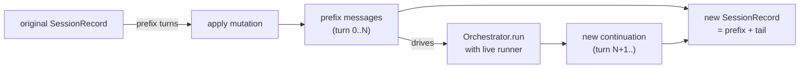
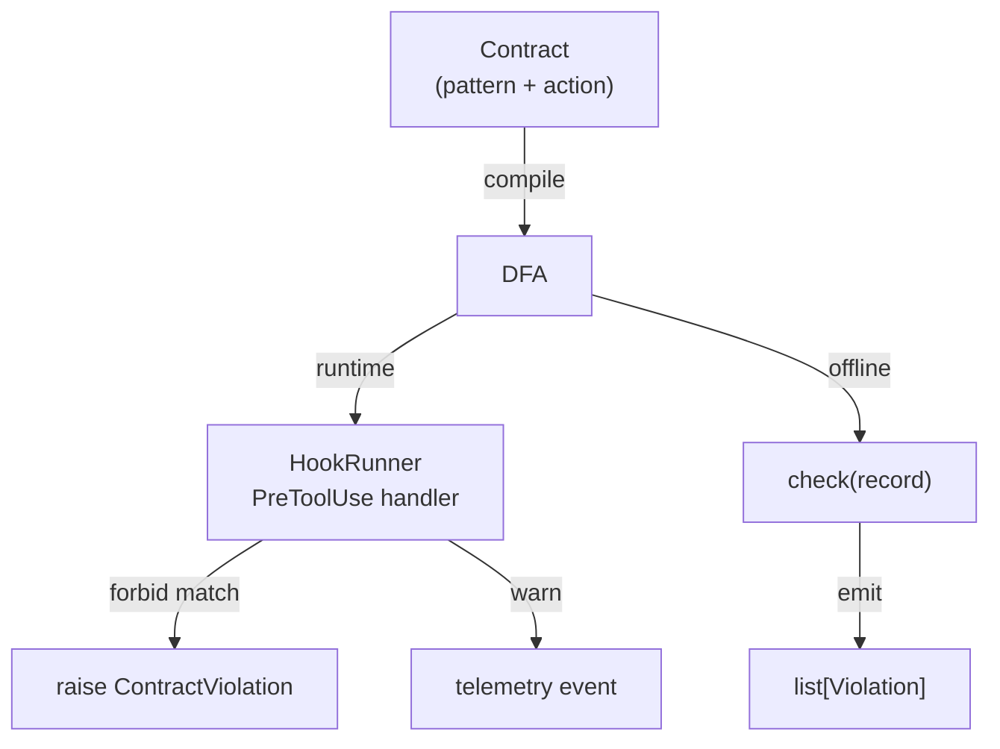
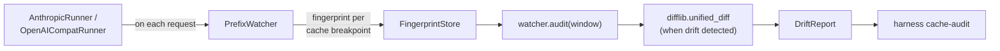
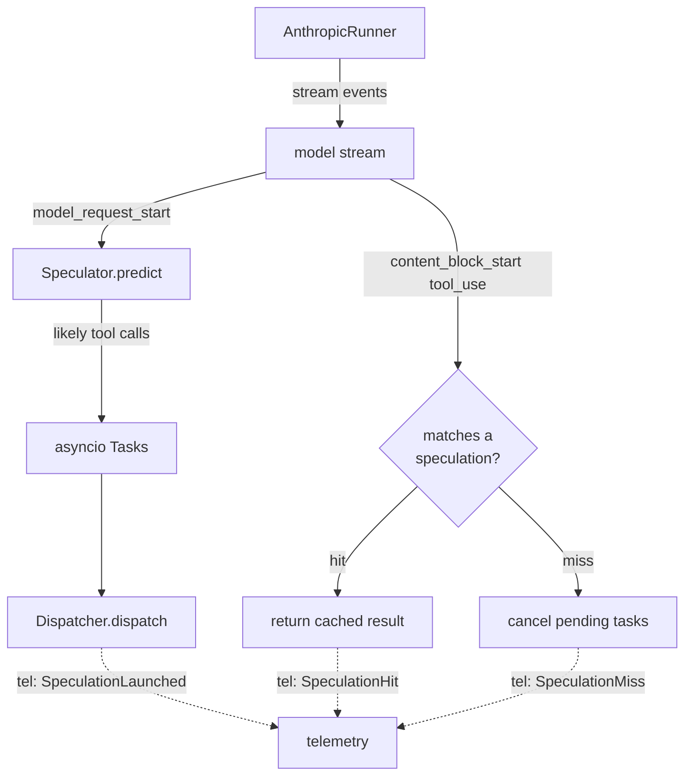
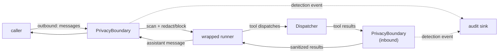
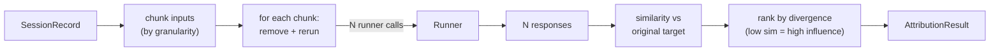
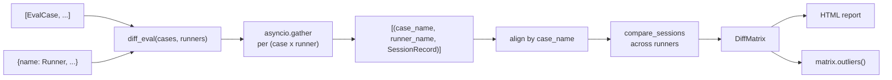
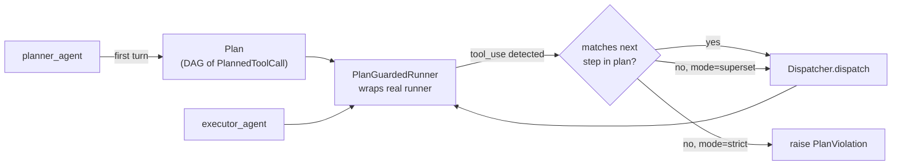
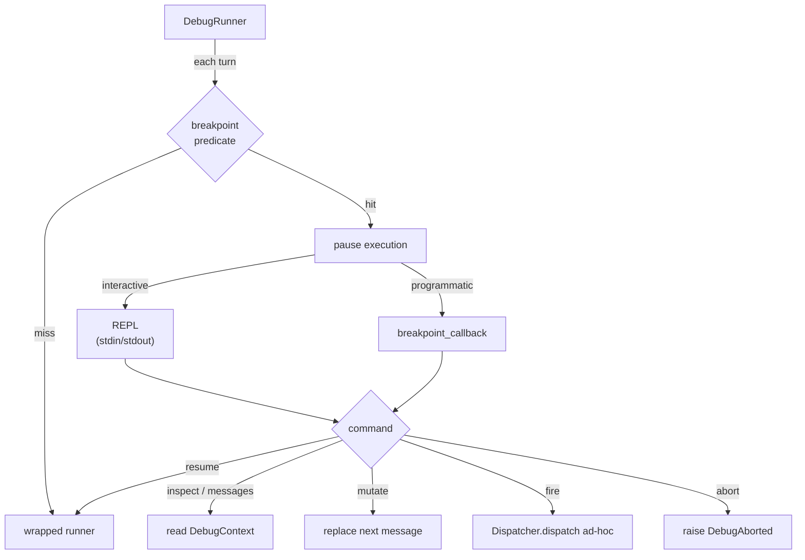

# Standout features — design doc

> Ten proposals that aren't already shipping in someone else's framework. None
> are committed yet — this file is the durable plan we iterate against.
>
> Each entry is structured so a reviewer can decide whether it hangs together
> at a glance, then drill in: API sketch, file list, test list, risks, effort.

## Summary

| #  | Feature | Builds on | LoC est. | Days | Independence | Pair-with |
| -- | ------- | --------- | -------- | ---- | ------------ | --------- |
| 1  | Counterfactual replay         | `replay`, `memory`             | ~200 src + ~250 test | 1.0 | yes | #2 |
| 2  | Behavioral contracts          | `hooks`, `memory`              | ~500 src + ~400 test | 2.0 | yes | #1, #9 |
| 3  | Prefix-drift watcher          | `runner`, `memory`             | ~400 src + ~300 test | 2.0 | runner hook | — |
| 4  | Tool surface fuzzing          | `tools`                        | ~300 src + ~300 test | 2.0 | yes ([fuzz] extra) | — |
| 5  | Speculative tool execution    | `runner`, `tools`, `telemetry` | ~500 src + ~400 test | 3.0 | runner integration | — |
| 6  | Privacy-boundary runner       | `runner`                       | ~400 src + ~400 test | 2.0 | wraps any runner | — |
| 7  | Causal provenance via ablation| `runner`, `prompts`            | ~400 src + ~250 test | 3.0 | offline batch | — |
| 8  | Differential cross-provider runs  | `replay`, `runner`         | ~250 src + ~250 test | 1.0 | extends `run_eval` | — |
| 9  | Plan-as-contract              | `agents`, `runner`             | ~450 src + ~400 test | 2.0 | overlaps #2 conceptually | #2 |
| 10 | Live agent REPL debugger      | `runner`, `agents`             | ~500 src + ~300 test | 3.0 | runner wrapper + CLI | — |

**Total:** ~3,900 src + ~3,250 test ≈ **7,150 LoC**, ~21 engineer-days.

**Recommended shipping order** (what unlocks the most value soonest):

1. **#1 Counterfactual** + **#2 Contracts** — together define a new category ("trajectory-typed agents") and double the value of every captured `SessionRecord`. ~3 days combined.
2. **#3 Prefix-drift** — solves a real production pain that costs real money; no other framework has it.
3. **#8 Differential** — quick win, instantly turns the existing `run_eval` into a cross-provider diff tool.
4. **#6 Privacy-boundary** — compliance unlock; wraps any runner.
5. The rest as bandwidth permits.

---

## 1 — Counterfactual replay

### Pitch
Take a recorded `SessionRecord`, mutate any turn (rewrite, insert, delete, swap a tool result), then deterministically replay everything downstream against any `Runner`. Answers *"what if the user had said no"* / *"what if the search had returned empty"* without re-running the whole session.

### Why standout
Inspect.ai supports trace inspection. LangSmith supports replay. **Nobody supports mutate-and-continue from an arbitrary point.** The closest research equivalent is "controlled rollouts," and it's never been productized as a primitive.

### Decisions
- **Build on `SessionRecord` + `ReplayRunner`.** Pre-mutation turns are replayed deterministically; from the divergence point forward, a real (or replay-of-different-session) `Runner` takes over.
- **Mutations are values, not callbacks.** `RewriteTurn(index, new_message)` rather than `lambda turn: ...` — so mutations serialize, can be stored, and produce reproducible counterfactuals.
- **Index by integer, not message identity.** Simpler than tracking a "before this turn" semantic.
- **Returns a fresh `SessionRecord`,** not a mutation of the input. Original session stays untouched.
- **No "modify the runner mid-run" magic.** The implementation runs `replay_runner` for the prefix turns, then calls the live runner once for the new continuation. Clean async semantics.

### API

```python
from harness.replay.counterfactual import (
    counterfactual,
    RewriteTurn, InsertTurn, DeleteTurn, ReplaceToolResult,
)

new_record = await counterfactual(
    session=original_record,
    mutation=RewriteTurn(index=4, new_message=text("user", "Actually, cancel that.")),
    runner=AnthropicRunner(dispatcher, hooks),
    orchestrator=Orchestrator(dispatcher, hooks, runner=...),
)
# new_record.messages[:4] == original.messages[:4]
# new_record.messages[4]  == the mutated message
# new_record.messages[5:] == fresh continuation from the runner
```

Mutation types:

```python
@dataclass(frozen=True) class RewriteTurn:        index: int; new_message: Message
@dataclass(frozen=True) class InsertTurn:         after: int; new_message: Message
@dataclass(frozen=True) class DeleteTurn:         index: int
@dataclass(frozen=True) class ReplaceToolResult:  turn: int; block: int; new_result: ToolResult
Mutation = RewriteTurn | InsertTurn | DeleteTurn | ReplaceToolResult
```

### Architecture



### Files

**New:**
- `src/harness/replay/counterfactual.py` — mutation dataclasses + `counterfactual()` function
- `tests/replay/test_counterfactual.py`

**Modified:**
- `src/harness/replay/__init__.py` — re-export
- `src/harness/__init__.py` — top-level re-exports
- `README.md` + `progress.md`

### Tests

1. **Rewrite a user turn** — assert turns 0..N-1 identical to original, turn N is the rewrite, turns N+1+ come from the live runner.
2. **Insert a user turn** — assert message count increases by ≥2 (insert + reply); inserted message present at correct index.
3. **Delete an assistant turn** — assert original turn N skipped; new turn N+1 fed back through runner.
4. **Replace a `tool_result`** — assert downstream assistant turns reflect the new result (using a runner that reads the tool result and echoes).
5. **Mutation at index 0** — entire history is regenerated.
6. **Mutation at the last turn** — runner is invoked once with the mutated tail.
7. **Out-of-bounds index raises `IndexError`** with a clear message.
8. **`ReplaceToolResult` errors when target block isn't a tool_result** — clear `ValueError`.
9. **Original `SessionRecord` is not mutated** — defensive deep-copy assertion.
10. **Pairs naturally with `compare_sessions`** — round-trip test asserting `compare_sessions(original, counterfactual_with_no_op)` matches everywhere except the mutation point.

### Risks / open questions

- **Cost.** Each counterfactual fires real model calls. Document; not a code concern.
- **Determinism downstream of the mutation.** The runner controls this — pass a `ReplayRunner` of a *different* recording for fully-deterministic CI; pass a real runner for live exploration.
- **Mutating tool calls without replaying their results** — when `RewriteTurn` rewrites an assistant message that contained a `tool_use`, what happens to the next user `tool_result`? Decision: the rewriter is responsible for keeping the tool call/result pairing consistent. Document, don't enforce.

### Out of scope
- Rewriting *part* of a message (mid-block edits) — full-message replacement only.
- Bulk mutations (apply N mutations at once) — composition is just a loop.
- Branching (one ancestor, multiple counterfactuals) — caller manages.

---

## 2 — Behavioral contracts

### Pitch
Declarative invariants over agent trajectories that compile to a state machine and run **both** as live runtime guardrails (via `HookRunner`) **and** as offline checks against recorded `SessionRecord`s. Type-checking for agent behavior.

### Why standout
Inspect.ai has trajectory assertions. AgentOps has post-hoc rule checking. Nobody has a single contract definition that *both* fails CI when checked against replay logs *and* blocks at execution time as a guardrail. The dual-mode is the differentiator — same spec, two enforcement surfaces.

### Decisions
- **Contracts are pure data.** A `Contract` is a Pydantic model: name + pattern + action. No closures inside the contract definition (closures don't serialize, can't store in a contract registry).
- **Pattern DSL is small but composable.** Predicates (`HasToolUse(name="...")`, `TextMatches(regex)`, `RoleIs(...)`) combined with temporal operators (`Always`, `Eventually`, `Earlier(req_pattern)`, `Never`).
- **State machine compiler.** A `Contract` compiles to a deterministic finite automaton over message events. Same automaton runs forward at runtime and offline against a record.
- **Three actions.** `forbid` (raise `ContractViolation`), `warn` (emit telemetry, continue), `require` (assert; raise if not satisfied by session end).
- **No magic.** Doesn't auto-translate natural-language specs. The user writes `Contract` instances by hand.

### API

```python
from harness.contracts import (
    Contract, attach_contracts, check,
    HasToolUse, TextMatches, RoleIs, Earlier, Never, Always, Eventually,
)

never_delete_prod = Contract(
    name="never_delete_prod",
    pattern=Never(HasToolUse(name="delete") & ArgMatches(table=r"^prod_")),
    action="forbid",
)

must_search_first = Contract(
    name="must_search_before_answer",
    pattern=Always(
        Earlier(HasToolUse(name="search"))
        .when(RoleIs("assistant") & TextMatches(r"^Answer:"))
    ),
    action="require",
)

# Runtime:
attach_contracts(hooks, [never_delete_prod, must_search_first])
# → hooks now block any tool call that would violate `never_delete_prod`
#   and emit telemetry on `must_search_first` violations at session-end.

# Offline (CI):
violations = check(session_record, [never_delete_prod, must_search_first])
assert violations == [], f"contract violations in regression set: {violations}"
```

### State-machine model

Each contract compiles to a tiny DFA whose states track:
- `unsatisfied` (require not yet seen)
- `pending` (currently inside a `when(...)` window)
- `satisfied` / `violated`

Per-message tick:
1. evaluate the per-message predicate
2. update state (any pattern-specific transitions)
3. if `forbid` action and current message matches, return `Violation(now=True)`
4. if `require` action and at end-of-session in unsatisfied state, return `Violation(at_end=True)`

### Architecture



### Files

**New:**
- `src/harness/contracts/__init__.py`
- `src/harness/contracts/predicates.py` — `HasToolUse`, `TextMatches`, `RoleIs`, `ArgMatches`, base `Predicate`
- `src/harness/contracts/patterns.py` — `Always`, `Eventually`, `Earlier`, `Never` temporal operators + `&`/`|` composition
- `src/harness/contracts/contract.py` — `Contract`, `Violation`, `ContractViolation`
- `src/harness/contracts/dfa.py` — compiler + runtime state machine
- `src/harness/contracts/runtime.py` — `attach_contracts(hooks, contracts)` integration
- `src/harness/contracts/check.py` — offline `check(record, contracts) -> list[Violation]`
- `tests/contracts/test_predicates.py`
- `tests/contracts/test_patterns.py`
- `tests/contracts/test_runtime.py`
- `tests/contracts/test_check.py`

**Modified:**
- `src/harness/__init__.py`
- `README.md`, `progress.md`

### Tests

**`test_predicates.py`:**
1. `HasToolUse(name="x")` matches an assistant message with a `tool_use` block named "x".
2. `ArgMatches(table=r"^prod_")` matches when the call argument matches.
3. `RoleIs` strict role match.
4. `TextMatches` runs against concatenated text.
5. `&` and `|` compose predicates correctly.

**`test_patterns.py`:**
6. `Never(p)` violated as soon as `p` matches; otherwise satisfied.
7. `Eventually(p)` satisfied if `p` matches anywhere; violated only at session end.
8. `Always(p)` requires `p` on every relevant message; first miss is violation.
9. `Earlier(req).when(trigger)` — `req` must have matched earlier; the `when` trigger gates the check.
10. Pattern composition: `Always(Earlier(A).when(B))` works.

**`test_runtime.py`:**
11. `attach_contracts` registers `forbid` contracts as `PreToolUse` hooks; matching call returns `HookDecision(block=True)`.
12. Multiple contracts: first `forbid` violation short-circuits per existing hook semantics.
13. `warn` contract emits a `telemetry` event but does not block.
14. `require` action is checked at `SessionEnd`; raises if unsatisfied.
15. Stateful patterns (`Earlier`) maintain state across hook calls within a single `Orchestrator.run`.

**`test_check.py`:**
16. Offline check on a record with no violations returns `[]`.
17. A `forbid` violation in the record is reported with `Violation(contract, message_index, kind="forbid_match")`.
18. A `require` not satisfied by end of record is reported with `kind="require_unmet"`.
19. Same contract definition produces the same verdict offline as it would have at runtime (regression test using a recorded session).
20. Integration: load a `SessionRecord` JSONL, run `check`, assert violations.

### Risks / open questions

- **Pattern DSL surface.** Start small. Resist adding regex-of-events / temporal logic until users ask. The predicates above cover ~80% of real cases.
- **Performance at runtime.** DFAs run in O(messages); negligible. Doc.
- **Predicate composition with closures.** Forbid `lambda` predicates? They work at runtime but break offline serialization. Decision: allow for `warn` / `require` (informational), forbid for hash-stable contract registries (later concern).

### Out of scope
- Natural-language → contract translation.
- Cross-session contracts ("user X never has more than 3 active sessions").
- Quantitative invariants ("p99 response under 5s") — that's telemetry, not contracts.
- Contract IDE / LSP support.

---

## 3 — Prefix-drift watcher

### Pitch
Fingerprints rendered prompt prefixes per cache breakpoint, alerts when a "stable" prefix unexpectedly changes byte-for-byte. Catches the silent invalidators (timestamp leak, dict reorder, varying tool list) that quietly destroy cache hit rate weeks before anyone notices the cost spike.

### Why standout
Cache observability in the LLM stack is uniformly bad. `usage.cache_read_input_tokens` tells you "0 hits today"; nothing tells you *why*. Anthropic's own docs list "common silent invalidators" but provide no tooling. This is the missing piece.

### Decisions
- **Render exactly what the SDK would send.** Use Pydantic's `model_dump_json(sort_keys=True)` for determinism; capture the bytes fed to the API at each cache breakpoint.
- **Hash-only by default.** Store SHA-256 per breakpoint plus a small "context fingerprint" (first 200 chars of each cache section). Full prompt storage is opt-in.
- **Sliding diagnostic window.** When a hash changes for a "stable" breakpoint, capture the next-and-previous full prompts, run `difflib.unified_diff`, surface the first 20 changed lines.
- **Pluggable fingerprint store.** Reuse `MemoryStore` semantics; ship `InMemoryFingerprintStore` and `FileFingerprintStore`.

### API

```python
from harness.cache import PrefixWatcher, FileFingerprintStore

watcher = PrefixWatcher(
    store=FileFingerprintStore("./.harness/fingerprints"),
    full_capture="on_drift",     # | "always" | "never"
)

runner = AnthropicRunner(dispatcher, hooks, prefix_watcher=watcher)
# (same kwarg added to OpenAICompatRunner)

# Periodic audit (CLI / cron / CI):
report = await watcher.audit(window_hours=24)
# report.stable_prefixes      → breakpoints whose hashes have stayed consistent
# report.drift_events         → list of DriftEvent with diff summary
```

CLI:
```bash
$ harness cache-audit --store ./.harness/fingerprints --since 24h
DRIFT detected at breakpoint 0 (system prompt) on 2026-04-12T14:03Z
  Diff (first 5 lines changed):
   - "current_time": "2026-04-12T13:58:11Z",
   + "current_time": "2026-04-12T14:03:42Z",
  Hint: looks like a timestamp leak — move out of the cached prefix or freeze it.
```

### Architecture



### Files

**New:**
- `src/harness/cache/__init__.py`
- `src/harness/cache/watcher.py` — `PrefixWatcher`, fingerprint logic
- `src/harness/cache/store.py` — `FingerprintStore` protocol + impls
- `src/harness/cache/audit.py` — `DriftReport`, `DriftEvent`, audit logic
- `src/harness/cache/cli.py` — `harness cache-audit` entry point
- `tests/cache/test_watcher.py`
- `tests/cache/test_store.py`
- `tests/cache/test_audit.py`

**Modified:**
- `src/harness/runner/anthropic.py` — accept `prefix_watcher` kwarg, call `watcher.fingerprint(request)` before each API call
- `src/harness/runner/openai_compat.py` — same
- `pyproject.toml` — add `[project.scripts] harness = "harness.cli:main"`
- `src/harness/cli.py` — top-level CLI dispatcher (also used by #10)

### Tests

1. `PrefixWatcher.fingerprint(request)` produces identical hashes for two identical request dicts.
2. A single byte change anywhere in the prefix produces a different hash.
3. Cache breakpoints in different positions hash independently.
4. `FingerprintStore` round-trips records.
5. `audit` returns no drift events when all hashes for a breakpoint are equal.
6. `audit` returns a `DriftEvent` with diff when a hash changes.
7. Diff captures the actual changed line(s) (regression: must surface the timestamp/uuid).
8. `full_capture="on_drift"` only captures full prompts when drift is detected.
9. CLI emits useful output for the common "timestamp leak" case (snapshot test).
10. Integration: wire watcher into a fake `AnthropicRunner` test, fire 5 requests with subtly-different prefixes, audit produces correct events.

### Risks / open questions

- **Storage growth.** A high-traffic deployment writes a fingerprint per request. Solution: TTL on fingerprints + sample-rate kwarg.
- **PII in captured prompts.** Default `full_capture="on_drift"` already minimizes; pair with #6 (privacy boundary) for full coverage.
- **Anthropic vs OpenAI cache semantics differ.** Anthropic has explicit `cache_control`; OpenAI's caching is server-side and opaque. For OpenAI: fingerprint by request prefix (best-effort, no breakpoint annotations). Document.

### Out of scope
- Live alerting (Slack / PagerDuty) — telemetry sink + downstream rule.
- Auto-remediation suggestions beyond simple text hints.
- Distributed fingerprint store — ship single-process; doc the extension point.

---

## 4 — Tool surface fuzzing

### Pitch
Hypothesis-style property testing applied to the *agent*, not the tools. Generates adversarial inputs (oversized, malformed, edge-case Unicode, boundary numbers) for each `Tool`'s Pydantic input model, drives them through the dispatcher (or full agent), and asserts graceful behavior.

### Why standout
Hypothesis exists. Schemathesis exists for OpenAPI. Nobody applies them to agent flows where the *model* is the consumer. The differentiator: properties about the *agent's* response to weird inputs, not just about the tool's response.

### Decisions
- **Optional `[fuzz]` extra** with `hypothesis>=6`. Base install untouched.
- **Pydantic strategy auto-derivation.** `pydantic-hypothesis` exists; use it. Fall back to manual strategy registration for fields it can't synthesize.
- **Two modes:**
  1. **Tool-only fuzzing:** drive inputs through `Dispatcher.dispatch(...)`. Asserts the handler doesn't crash and returns a `ToolResult` (error or not).
  2. **Agent-end-to-end fuzzing:** drive inputs through the agent via a `Runner`. Asserts the agent produces a graceful response (not a crash, not a 5-deep tool retry loop).
- **Reproducible failures.** Use Hypothesis' built-in shrinking and reproducer file. Store offending inputs in `harness.memory` for replay.

### API

```python
from harness.fuzz import fuzz_tool, fuzz_agent

# Mode 1: tool only
report = await fuzz_tool(dispatcher, tool_name="parse_csv", n=200)
# report.failures: list of (input, exception_or_result)

# Mode 2: agent
report = await fuzz_agent(
    orchestrator,
    agent,
    tool_name="parse_csv",
    n=50,
    invariant=lambda result: result.role == "assistant",
)
```

Decorator-style for pytest:
```python
from harness.fuzz import harness_property

@harness_property(dispatcher=my_disp, tool="parse_csv", n=100)
async def csv_handler_never_crashes(payload):  # payload generated automatically
    result = await my_disp.dispatch(ToolCall("parse_csv", {"raw": payload}))
    # implicit invariant: did not raise; returned a ToolResult
```

### Files

**New:**
- `src/harness/fuzz/__init__.py`
- `src/harness/fuzz/strategies.py` — Pydantic to Hypothesis bridge
- `src/harness/fuzz/runner.py` — `fuzz_tool`, `fuzz_agent`
- `src/harness/fuzz/decorators.py` — `harness_property` pytest helper
- `tests/fuzz/test_strategies.py`
- `tests/fuzz/test_runner.py`
- `tests/fuzz/test_decorators.py`

**Modified:**
- `pyproject.toml` — add `[fuzz] = ["hypothesis>=6"]`
- `src/harness/__init__.py` — top-level lazy re-export
- `README.md`, `progress.md`

### Tests

1. Pydantic model -> strategy: `BaseModel(text: str, n: int)` produces strings + ints.
2. Strategy with `Field(min_length=1)` honoured.
3. `fuzz_tool` with N=100 against a tool that raises on empty strings -> report.failures contains `""`.
4. `fuzz_tool` with a tool that handles everything -> empty failures.
5. Reproducer: a failure replayed deterministically returns the same result.
6. `fuzz_agent` with a fake runner that always returns the same string -> invariant pass.
7. `fuzz_agent` with a runner that crashes on certain inputs -> reported in failures.
8. Decorator integrates with pytest (skip if `hypothesis` not installed).
9. Missing `[fuzz]` extra raises clear `ImportError`.

### Risks / open questions

- **Cost (mode 2).** Agent fuzzing fires real model calls. Default `n=20`, document, gate with `@pytest.mark.fuzz` markers.
- **Hypothesis auto-derivation gaps.** Pydantic v2 has nested types we may not synthesize cleanly. Fall back: caller registers strategy manually.
- **Flakiness.** Hypothesis examples vary per run unless seeded. Default `seed=0`; emit reproducer paths.

### Out of scope
- Coverage-guided fuzzing (AFL-style).
- LLM-generated adversarial inputs (the model picking weird inputs) — separate idea.
- Mutation-based fuzzing of recorded sessions — close to #1 + #4 but not the same thing.

---

## 5 — Speculative tool execution

### Pitch
While the model is generating the next response, the harness predicts likely tool calls from recent trajectory and pre-executes them. If the model lands on a predicted call, the result is already cached - near-zero latency. Wrong predictions are cheap (just a wasted tool call).

### Why standout
This is research-grade. There's an Anthropic blog post mentioning "speculative tool execution" but no public implementation. Latency-critical interactive agents (voice, copilot) currently can't do this without rolling their own.

### Decisions
- **Predictor is pluggable.** Ship `LastCallPredictor` (just predict whatever the model called last with similar args) and a `SequencePredictor` (count N-grams over the last K turns). External predictors can implement a `Predictor` protocol.
- **Cap concurrency.** `max_speculations=2` parallel by default. Don't speculate inside a speculation.
- **Fire and cancel.** Speculations run in `asyncio.tasks` with `task.cancel()` if the model lands somewhere else. Cancellation is best-effort - already-running tools may complete; their results are discarded.
- **Telemetry hooks.** Emit `SpeculationLaunched`, `SpeculationHit`, `SpeculationMiss` events for hit-rate measurement.
- **Idempotency assumption.** Speculation only fires for tools marked `idempotent=True` on the `Tool` definition. Keeps us safe - won't speculate on `send_email`.

### API

```python
from harness.speculate import Speculator, LastCallPredictor

speculator = Speculator(
    predictor=LastCallPredictor(history_window=3),
    max_speculations=2,
    only_idempotent=True,
)

runner = AnthropicRunner(dispatcher, hooks, speculator=speculator)

# Tool definition gains an `idempotent` flag:
Tool(name="search", ..., idempotent=True)
```

### Architecture



### Files

**New:**
- `src/harness/speculate/__init__.py`
- `src/harness/speculate/predictor.py` — `Predictor` protocol, `LastCallPredictor`, `SequencePredictor`
- `src/harness/speculate/speculator.py` — `Speculator`, task lifecycle, hit/miss accounting
- `src/harness/speculate/events.py` — telemetry event types
- `tests/speculate/test_predictor.py`
- `tests/speculate/test_speculator.py`
- `tests/speculate/test_integration.py`

**Modified:**
- `src/harness/tools/schema.py` — add `idempotent: bool = False` to `Tool`
- `src/harness/runner/anthropic.py` — wire speculator into the streaming loop
- `src/harness/runner/openai_compat.py` — same
- `src/harness/telemetry/events.py` — register new events

### Tests

1. `LastCallPredictor` with history `[search("a"), search("b")]` predicts `search` for the next call.
2. Predictor returns nothing when no idempotent tools have been called recently.
3. `Speculator.predict` honours `max_speculations` cap.
4. Hit: prediction matches actual call; result returned without re-dispatch.
5. Miss: prediction doesn't match; pending tasks cancelled; actual call dispatched normally.
6. Telemetry events fire at correct points (use `MemorySink`).
7. Non-idempotent tool: speculator refuses to predict it.
8. Concurrency: 2 speculations + 1 model continuation run truly in parallel (wall-clock test).
9. Cancellation: a slow speculative tool that gets cancelled doesn't pollute later requests.
10. Integration: end-to-end flow with a fake streaming response and a fake tool that simulates 100ms latency, hit case beats baseline by >=80ms.

### Risks / open questions

- **Streaming integration is the hardest part.** AnthropicRunner currently uses `get_final_message()` (non-streaming-from-caller-perspective). To predict during generation we need to peek at stream events. Possible: switch to streaming with our own event handler that wraps `get_final_message`.
- **Concurrency safety.** Speculations interact with the dispatcher; the dispatcher has to be safe under concurrent dispatch (it is - no shared mutable state besides the registry, which is read-only at dispatch time).
- **What about hooks?** Speculative pre-tool hooks fire? Decision: yes - speculations go through the same `PreToolUse` flow. Side effect: a `BlockingPolicy` blocks the speculation, which is fine.

### Out of scope
- ML-based prediction (train a small classifier on recorded sessions). Future.
- Cross-session speculation cache (predict from last user's session). Future.
- Speculative model dispatch (run two models in parallel, take the first to complete) — different idea.

---

## 6 — Privacy-boundary runner

### Pitch
A runner wrapper that treats the prompt boundary as a *compliance boundary*. Pattern + entropy detection scans every outbound message and every inbound tool result; secrets (API keys, tokens) and PII (SSN, credit-card, email patterns) are refused (or auto-redacted with audit trail) before they enter the context window.

### Why standout
PII filters exist (Microsoft Presidio, AWS Comprehend, etc.). Secret scanners exist (gitleaks, trufflehog). **Nobody wires them as a transparent harness layer that gates the prompt boundary specifically.** The framing — "your context window is a regulated surface, secrets must not cross it" — is the differentiator.

### Decisions
- **Wraps any `Runner`.** `PrivacyBoundary(detectors, on_detect="redact").wrap(real_runner)` returns a new runner satisfying the same protocol.
- **Detectors are composable.** Ship `RegexDetector` (configurable patterns), `EntropyDetector` (Shannon entropy threshold), pre-built detector packs (`SECRET_PACK`, `PII_PACK`, `HIPAA_PACK`).
- **Three actions.** `redact` (replace match with `[REDACTED:type]`), `block` (raise `PrivacyViolation`), `audit` (log + pass-through).
- **Audit trail.** Every detection emits a structured event to a configurable sink — what was detected, where (system / user / assistant / tool_result), what action was taken. **The audit event itself never contains the detected value.**
- **Direction-aware.** Some patterns matter on outbound (don't send a customer SSN to the LLM); others on inbound (don't let the LLM exfiltrate a secret it found). Each detector configures its directions.

### API

```python
from harness.privacy import (
    PrivacyBoundary, RegexDetector, EntropyDetector,
    SECRET_PACK, PII_PACK,
)

boundary = PrivacyBoundary(
    detectors=[*SECRET_PACK, *PII_PACK, EntropyDetector(min_entropy=4.5, min_length=24)],
    on_detect="redact",
    audit_sink=JSONLSink("./privacy.jsonl"),
)

runner = boundary.wrap(AnthropicRunner(dispatcher, hooks))
```

Direction-specific:
```python
boundary = PrivacyBoundary(
    detectors=[
        RegexDetector(name="aws_key", pattern=r"AKIA[A-Z0-9]{16}", direction="both", action="block"),
        RegexDetector(name="ssn",     pattern=r"\b\d{3}-\d{2}-\d{4}\b", direction="outbound", action="redact"),
    ],
)
```

### Architecture



### Files

**New:**
- `src/harness/privacy/__init__.py`
- `src/harness/privacy/detectors.py` — `Detector` protocol, `RegexDetector`, `EntropyDetector`
- `src/harness/privacy/packs.py` — pre-built detector packs (SECRET_PACK, PII_PACK, HIPAA_PACK)
- `src/harness/privacy/boundary.py` — `PrivacyBoundary`, the wrapping logic
- `src/harness/privacy/events.py` — `DetectionEvent`
- `tests/privacy/test_detectors.py`
- `tests/privacy/test_boundary.py`

**Modified:**
- `src/harness/__init__.py`
- `README.md`, `progress.md`

### Tests

1. `RegexDetector(pattern=r"AKIA...")` matches an AWS-key-shaped string in a message.
2. `EntropyDetector(min_entropy=4.5)` flags `"x" * 30` (low entropy -> no flag) vs a real high-entropy string (flag).
3. `redact` replaces match with `[REDACTED:name]`.
4. `block` raises `PrivacyViolation` and the inner runner is never called.
5. `audit` passes through unchanged; emits an event.
6. `direction="outbound"` only triggers on messages going to the runner.
7. `direction="inbound"` only triggers on tool results coming back.
8. Audit event does NOT contain the detected value (only its type, length, location).
9. Pre-built `SECRET_PACK` catches: AWS key, GitHub token, Stripe key, Anthropic API key.
10. Pre-built `PII_PACK` catches: US SSN, US phone, email.
11. End-to-end: a fake runner that would have received a SSN sees `[REDACTED:ssn]` instead.
12. `wrap` returns an object satisfying the `Runner` protocol (callable, async).

### Risks / open questions

- **False positives on entropy detection.** Long base64 strings flag. Tune defaults; document; allow per-detector min-length thresholds.
- **Performance.** Regex-heavy on every message. Acceptable for most workloads; flag if >10% overhead in a benchmark.
- **Adversarial agents.** A model can split a secret across messages to evade detection. Document; this is detection at the boundary, not bulletproof DLP.

### Out of scope
- ML-based PII detection (Presidio integration as optional adapter — future).
- Encryption / tokenization.
- Audit-log signing / tamper-evidence.

---

## 7 — Causal provenance via ablation

### Pitch
For any output of interest, identify which input chunks actually drove it - by re-running with each chunk removed and measuring divergence. Provider-agnostic (works on any black-box model). Lets you walk back from a hallucinated answer to the specific document/sentence that caused it.

### Why standout
Citation-aware providers (Anthropic with citations, some RAG frameworks) expose grounding. **Black-box ablation works on every model.** Researchers call this "leave-one-out attribution"; it's been published; nobody productized it as a debugging primitive.

### Decisions
- **Granularity is configurable.** `message`, `block`, or `sentence` (using a simple sentence splitter). Caller picks the trade-off between precision and cost.
- **Similarity metric is pluggable.** Ship `JaccardSimilarity` (token overlap, no deps), `LengthRatio` (zero-cost crude), and an optional `EmbeddingSimilarity` under `[attribute]` extra (uses `sentence-transformers`).
- **Cost transparency.** Every call to `attribute()` reports an estimated number of model invocations up-front; caller confirms or pre-budgets.
- **Caching.** Re-run requests are deterministic if the model is - store responses keyed by (input_hash, target_index) so re-runs are cheap.
- **Top-K.** Returns ranked attributions, not just the most-influential chunk.

### API

```python
from harness.attribute import attribute, JaccardSimilarity, EmbeddingSimilarity

attribution = await attribute(
    session,
    target_message_index=-1,  # last assistant message
    runner=AnthropicRunner(...),
    granularity="block",
    similarity=JaccardSimilarity(),
    estimate_only=False,
)
attribution.top_k(5)
# [
#   AttributionChunk(message_index=2, block_index=0, score=0.81, preview="The patient was..."),
#   AttributionChunk(message_index=5, block_index=2, score=0.42, ...),
#   ...
# ]
```

### Architecture



### Files

**New:**
- `src/harness/attribute/__init__.py`
- `src/harness/attribute/ablation.py` — chunking, ablation loop, ranking
- `src/harness/attribute/similarity.py` — `Jaccard`, `LengthRatio`, optional `Embedding`
- `src/harness/attribute/cache.py` — response cache by (input_hash, target_index)
- `tests/attribute/test_ablation.py`
- `tests/attribute/test_similarity.py`

**Modified:**
- `pyproject.toml` — `[attribute] = ["sentence-transformers>=2"]`
- `src/harness/__init__.py`
- `README.md`, `progress.md`

### Tests

1. Chunking by message: a 5-message session yields 5 chunks (system messages excluded by default? configurable).
2. Chunking by block: a message with 3 blocks yields 3 chunks.
3. Chunking by sentence: a 4-sentence text block yields 4 chunks.
4. `JaccardSimilarity` returns 1.0 for identical strings, ~0 for disjoint vocab.
5. Ablation runs N=`chunks_count` runner calls.
6. Ablation with `estimate_only=True` reports cost without making calls.
7. Top-k attribution: a synthetic session where chunk-3 is the obvious cause produces chunk-3 as #1.
8. Cache: second call to `attribute` on the same session is significantly faster (warm cache).
9. Missing `[attribute]` extra raises clear `ImportError` for `EmbeddingSimilarity`.
10. Integration with a fake runner that always returns `chunk_3.text` to demonstrate causal attribution.

### Risks / open questions

- **Cost.** N+1 model calls per attribution. Document; recommend small `n` granularity for routine use.
- **Determinism.** If the model is non-deterministic, ablation noise dominates. Pin temperature=0 (or document — adaptive thinking models have other levers).
- **Counterfactual confound (#1 vs #7).** Counterfactual mutates *one* turn and observes *all* downstream changes. Attribution removes *each* chunk and observes *one* response change. They answer different questions; document the distinction clearly.

### Out of scope
- Gradient-based attribution (closed-source models don't expose gradients).
- Token-level attribution (per-token ablation is cost-prohibitive).
- Attention-map visualization (also requires gradient access).

---

## 8 — Differential cross-provider runs

### Pitch
Run the same `EvalCase` set against multiple `Runner`s in parallel; surface where they disagree. Same case set, multiple providers, automatic outlier detection.

### Why standout
Most evaluation frameworks are single-provider — Inspect, OpenAI's evals, Anthropic's evaluation tools, etc. The few cross-provider tools (helmless leaderboards) optimize for benchmarking, not regression hunting. The "find me the cases where ONE of my providers disagrees with the consensus" framing is missing.

### Decisions
- **Build on existing `run_eval`.** New `diff_eval` orchestrates `run_eval` per runner, in parallel, then aligns results by case name.
- **Outlier detection via `compare_sessions`.** Already-implemented diff logic; extends naturally.
- **Reports surface clusters.** Group cases by agreement structure: "all agree", "anthropic disagrees", "openai+ollama disagree", etc.
- **HTML report.** Static file with per-case row, columns per runner, color-coded agreement. Makes the output skimmable.

### API

```python
from harness.replay import diff_eval

matrix = await diff_eval(
    cases=my_cases,
    agent=my_agent,
    runners={
        "anthropic": AnthropicRunner(dispatcher, hooks),
        "ollama":    OpenAICompatRunner(dispatcher, hooks, base_url="http://localhost:11434/v1"),
        "groq":      OpenAICompatRunner(dispatcher, hooks, base_url="https://api.groq.com/openai/v1"),
    },
)

# Inspect:
matrix.outliers()                 # list of (case, dissenting_runner, diff)
matrix.unanimous()                # cases where all runners agree
matrix.report_html("./diff.html")  # static HTML matrix
```

### Architecture



### Files

**New:**
- `src/harness/replay/diff_eval.py` — `diff_eval`, `DiffMatrix`, HTML report generator
- `src/harness/replay/templates/diff_report.html` — string `Template`, no Jinja
- `tests/replay/test_diff_eval.py`

**Modified:**
- `src/harness/replay/__init__.py`
- `src/harness/__init__.py`
- `README.md`, `progress.md`

### Tests

1. `diff_eval` with one case and three runners runs 3 sessions in parallel.
2. Cases x runners product: 5 cases x 3 runners = 15 sessions.
3. `unanimous()` returns cases where all runner diffs match.
4. `outliers(threshold=1.0)` returns cases with at least one mismatched runner.
5. Cluster detection: when 2 runners agree and 1 disagrees, the dissenter is identified.
6. HTML report renders without errors (snapshot test on a small matrix).
7. Concurrency: total wall time ~ slowest runner x cases (gathered, not serialized).
8. With a `MemorySink` telemetry, every session emits a `OrchestratorTurn` event.

### Risks / open questions

- **Cost.** N runners x M cases x K turns each. Document; recommend small starter sets.
- **Different runners hit different APIs.** Cross-provider rate limits; failures should be isolated (one runner failing shouldn't kill the whole run). Use `asyncio.gather(..., return_exceptions=True)`.
- **Tool-call ID divergence.** Already handled by `compare_sessions` ID-stripping.

### Out of scope
- Pass/fail grading (just diff, not "right answer" evaluation) — leave to existing eval frameworks.
- Statistical significance testing across runs.
- A built-in benchmark suite (HumanEval-mini, GSM8K-mini) — separate idea.

---

## 9 — Plan-as-contract

### Pitch
Two-phase architecture: a planner agent emits a structured `Plan` (DAG of expected tool calls with arguments). The executor agent runs against that plan. *Any deviation* — different tool, different args, extra call — raises `PlanViolation`. Inspired by formal methods: the plan IS the contract; drift is a failure.

### Why standout
AutoGPT-era plans were unstructured. ReAct papers have planner/actor splits but no enforcement. AgentSpec / language-model-as-OS papers describe this; nobody has it as a primitive. The "plan as a verified contract, deviation is a bug" framing is the differentiator.

### Decisions
- **The plan is data.** Pydantic model with steps; serializable; storable in `MemoryStore`.
- **Argument-matching modes per step.** Exact dict match, regex match per field, or callable (predicate). Caller chooses the strictness level.
- **Deviation modes.** `strict` (any deviation raises), `superset` (plan is minimum; extra calls allowed), `subset` (plan is maximum; missing calls allowed). Default `strict`.
- **Runner wrapper.** `PlanGuardedRunner(real_runner, plan, mode)` enforces the plan; reuses the existing `Runner` protocol so the executor's orchestrator doesn't change.
- **Composability with #2 (contracts).** A `Plan` compiles to a sequence of `Always(HasToolUse(...))` contracts internally. Same DFA underneath.

### API

```python
from harness.plan import Plan, PlannedToolCall, PlanGuardedRunner

plan = Plan(
    steps=[
        PlannedToolCall(tool_name="search", arguments_match={"q": "exact"}),
        PlannedToolCall(tool_name="parse",  arguments_match=lambda args: "result" in args),
        PlannedToolCall(tool_name="summarize"),  # any args ok
    ],
    mode="strict",
)

# Generate a plan from a planner agent (helper):
plan = await derive_plan(planner_agent, planner_runner, messages)

# Execute under guard:
guarded = PlanGuardedRunner(real_runner, plan)
orchestrator = Orchestrator(dispatcher, hooks, guarded)
try:
    result = await orchestrator.run(executor_agent, messages)
except PlanViolation as exc:
    print(exc.expected, exc.actual, exc.step_index)
```

### Architecture



### Files

**New:**
- `src/harness/plan/__init__.py`
- `src/harness/plan/plan.py` — `Plan`, `PlannedToolCall`, `PlanViolation`
- `src/harness/plan/guard.py` — `PlanGuardedRunner`
- `src/harness/plan/derive.py` — `derive_plan()` helper that uses a runner to emit a structured plan (via a JSON schema)
- `tests/plan/test_plan.py`
- `tests/plan/test_guard.py`
- `tests/plan/test_derive.py`

**Modified:**
- `src/harness/__init__.py`
- `README.md`, `progress.md`

### Tests

1. `Plan(steps=[...])` round-trips through JSON.
2. `PlannedToolCall(arguments_match=dict)` exact match: matching args pass; different args fail.
3. `arguments_match=callable` runs the predicate.
4. `PlanGuardedRunner` strict mode: executor calls expected tool -> passes; calls different tool -> `PlanViolation`.
5. Strict mode: extra tool call beyond the plan -> `PlanViolation`.
6. Superset mode: extra tool call -> allowed.
7. Subset mode: missing a planned tool -> allowed; wrong-tool still fails.
8. `PlanViolation.step_index` and `.expected` / `.actual` are populated.
9. `derive_plan()` with a fake runner that returns a JSON-schema plan: returns a parsed `Plan`.
10. End-to-end: planner produces plan, executor follows, success path.
11. End-to-end: planner produces plan, executor deviates, `PlanViolation` raised at the right step.

### Risks / open questions

- **Argument matching is hard.** Real model-emitted args are messy (whitespace, ordering). Default matching mode for dicts is "loose equality" — same keys, normalized strings. Document; add explicit `arguments_exact_match=True` for strictness.
- **Concurrent tool calls in one assistant turn.** Plan steps are sequential by default; multi-tool turns are flat-mapped against the next K steps. Document.
- **Plan becomes outdated.** When the planner doesn't anticipate a tool, executor fails. Document; recommend `mode="superset"` for early adoption.

### Out of scope
- Plan inference from past sessions (mining plans from successful trajectories) — future.
- Plan diffing / merging.
- Visual plan editors.

---

## 10 — Live agent REPL debugger

### Pitch
`pdb` for orchestrator runs. Pause mid-trajectory, inspect message history, mutate the next turn, fire ad-hoc tool calls, resume.

### Why standout
Every framework has logging. LangSmith has trace inspection. **Nobody has interactive debugging where you can mutate state and continue.** The closest analog is Jupyter notebooks where you reconstruct state manually — slow, error-prone.

### Decisions
- **Two flavors.** Interactive (TTY REPL via stdlib `code.InteractiveConsole`, async-aware via aiomonitor or a custom asyncio runloop) and programmatic (a `breakpoint_callback` that gets a `DebugContext` and returns a decision).
- **Wraps any runner.** `DebugRunner(real_runner, breakpoint=...)` returns a runner satisfying the protocol.
- **Breakpoints are predicates.** `lambda turn: turn.tool_name == "delete"` or `lambda turn: turn.index == 5`.
- **REPL exposes a small surface.** `messages`, `mutate(message)`, `fire(tool, args)`, `inspect(...)`, `resume()`, `abort()`.
- **CLI for offline replay debugging.** `harness debug session.jsonl --break turn=5` loads a recorded session, replays it through a `ReplayRunner`, breaks at turn 5, drops to REPL.

### API

Programmatic:
```python
from harness.debug import DebugRunner, DebugContext

def my_breakpoint(ctx: DebugContext) -> None:
    if ctx.last_call and ctx.last_call.name == "delete":
        ctx.print(f"about to call delete with {ctx.last_call.arguments}")
        ctx.fire("read", {"path": "/audit.log"})  # ad-hoc tool call
        ctx.mutate(text("user", "Wait, cancel that delete"))
        ctx.resume()

runner = DebugRunner(real_runner, breakpoint_callback=my_breakpoint)
```

Interactive:
```python
runner = DebugRunner(real_runner, interactive=True, break_on=lambda c: c.turn_index == 5)
```

CLI:
```bash
$ harness debug ./events.jsonl --break turn=5
[harness-debug] Loaded session sess_abc123, paused at turn 5
[harness-debug] Last action: assistant tool_use 'delete' arguments={'path': '/prod_data'}
> messages
  [0] system: "you are helpful"
  [1] user: "delete the test data"
  [2] assistant: tool_use(delete, /prod_data)
  ...
> mutate text("user", "wait, only delete /test_data")
> resume
[harness-debug] Resuming with mutated turn 5...
```

### Architecture



### Files

**New:**
- `src/harness/debug/__init__.py`
- `src/harness/debug/context.py` — `DebugContext` class
- `src/harness/debug/runner.py` — `DebugRunner`, breakpoint plumbing
- `src/harness/debug/repl.py` — interactive `code.InteractiveConsole` wrapper
- `src/harness/debug/cli.py` — `harness debug` entry point
- `tests/debug/test_context.py`
- `tests/debug/test_runner.py`
- `tests/debug/test_repl.py` — uses `pexpect`-style scripted I/O

**Modified:**
- `src/harness/cli.py` — register `harness debug` subcommand
- `pyproject.toml` — `[project.scripts] harness = "harness.cli:main"` (also used by #3)
- `src/harness/__init__.py`
- `README.md`, `progress.md`

### Tests

1. `DebugContext` exposes `.messages`, `.last_call`, `.turn_index`.
2. `mutate(msg)` replaces the next message in the conversation history.
3. `fire(tool, args)` dispatches ad-hoc and returns the result; does not advance the conversation.
4. Breakpoint predicate: only triggers when condition is true.
5. Programmatic callback: `resume()` continues execution; `abort()` raises `DebugAborted`.
6. `DebugRunner` satisfies the `Runner` protocol (callable, async).
7. CLI: `harness debug` loads a session, breaks at the configured turn (scripted I/O test using `pexpect`).
8. Integration: programmatic mode runs end-to-end without TTY.
9. Mutation persists into the resulting `Message` returned by the runner.
10. Multiple breakpoints in sequence work correctly.

### Risks / open questions

- **Async REPL.** `code.InteractiveConsole` is sync. To run inside an asyncio event loop, we either:
  (a) run the REPL in a thread and proxy commands via `asyncio.run_coroutine_threadsafe`, or
  (b) use `aiomonitor` (mature, ships a console).
  Default to (a); start with sync REPL in a thread; doc.
- **State mutation safety.** Mutating message history mid-flight could break the runner's invariants. Restrict mutation to the *next* turn; document.
- **CLI surface bleed.** A real CLI starts to need argparse, click, etc. Use stdlib `argparse`; cap surface at 3 commands (#3 audit, #10 debug, plus inspect/run later).

### Out of scope
- IDE-protocol debugger (DAP) integration — future.
- Time-travel within a debug session (rewind to earlier turn).
- Multi-process / distributed debugging.

---

## Cross-cutting concerns

### A common CLI

Features #3, #6 (with audit subcommand), #9 (plan inspect), #10 all want a CLI. Land a single `harness` entry point in `src/harness/cli.py` with `argparse` subcommands; each feature registers its own subcommand. Avoids 5 separate scripts.

```bash
$ harness --help
  cache-audit    Audit prompt cache fingerprints (#3)
  fuzz           Run a fuzz harness (#4)
  attribute      Run causal attribution (#7)
  diff           Run cross-provider differential check (#8)
  inspect        Pretty-print a SessionRecord (#9 + general)
  debug          Interactive debug REPL (#10)
```

### Cross-feature pairings

- **#1 + #2** define the "trajectory-typed agent" category (mutate + spec).
- **#2 + #9** are conceptually similar; #9 is a special case of #2 (a Plan compiles to a sequence of contracts). Implement #2 first; rebuild #9's `PlanGuardedRunner` on top of it.
- **#3 + #6** are both "what crosses the prompt boundary": #3 watches for drift, #6 enforces policy. Separate modules but share the rendering helper that produces the same bytes the SDK sends.
- **#5 + #7** stress the runner internals; coordinate the streaming integration once.

### Shared utilities to add

- `src/harness/_internal/render.py` — produce the exact bytes the SDK would send, used by #3 and #6.
- `src/harness/_internal/dfa.py` — small DFA framework, used by #2 and #9.
- `src/harness/_internal/cli_kit.py` — minimal argparse helpers, used by all CLI subcommands.

### Documentation

Each feature lands with:
- A short README section in the module-table (one row).
- An entry in `progress.md` with the implementation log.
- A worked example in `examples/<feature>.py` (no API key needed; uses `EchoRunner` or `CannedRunner`).

### Versioning

Currently `__version__ = "0.0.1"`. After the four high-priority features (#1 + #2 + #3 + #8), bump to `0.1.0`. After all 10, bump to `0.2.0`.

---

## What I'd ship first

**Sprint 1 (3-4 days):** #1 Counterfactual + #2 Behavioral contracts. They define a category and reinforce each other. Most value per LoC.

**Sprint 2 (2 days):** #3 Prefix-drift watcher + #8 Differential. Pure observability wins; no new conceptual surface.

**Sprint 3 (4 days):** #6 Privacy boundary + #4 Tool fuzzing. Compliance + reliability. Mostly self-contained.

**Sprint 4 (3 days):** #10 Live REPL debugger + the shared CLI. Quality-of-life payoff.

**Sprint 5 (5 days):** #5 Speculative execution + #7 Causal provenance. The two research-grade items; do them last because they have the most unknowns.

**Sprint 6 (2 days):** #9 Plan-as-contract. Built on top of #2's DFA infrastructure.

Total: ~19-20 engineer-days for all ten, sequenced so the first ship is two days out.
