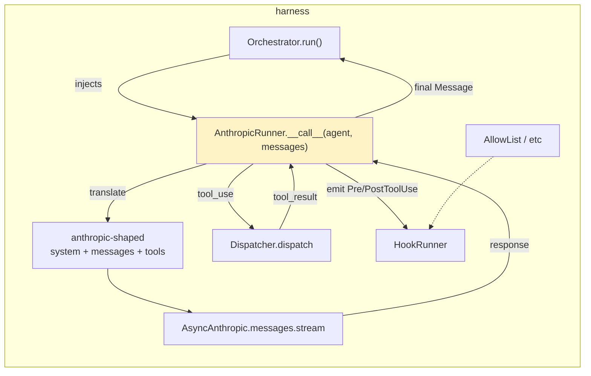

# Roadmap progress log

> Living document for the post-MVP roadmap work on `harness-engineering`.
> Each item gets its own section with plan, decisions, and a per-step log.
> Append-only — older entries stay; status is updated in place.

## Status snapshot

| # | Item                                   | Status      | Branch / PR                                    |
| - | -------------------------------------- | ----------- | ---------------------------------------------- |
| 0 | MVP scaffold (tools/prompts/hooks/agents/policy) | shipped | PR #1 (`chore/initial-scaffold` → `main`)      |
| 1 | Real model runner + summarization-compaction | planning | TBD                                            |
| 2 | Telemetry / structured event stream    | pending     | TBD                                            |
| 3 | Persistent memory / session storage    | pending     | TBD                                            |
| 4 | Sandbox execution primitives           | pending     | TBD                                            |
| 5 | Replay / eval harness                  | pending     | TBD                                            |

## Order rationale

The dependency graph determined the order. Telemetry could have gone first
(foundation for replay/eval) but the real model runner is the highest-visibility
gap — without it, the library is glue with no model. Telemetry comes next so
the runner, memory, sandbox, and replay all emit through the same stream.

```
[1] real-model-runner ──┐
                         ├──► [2] telemetry ──► [5] replay/eval
                         │           ▲
                         ▼           │
   summarization-compaction          │
                                     │
[3] persistent-memory  ──────────────┤
[4] sandbox-execution  ──────────────┘
```

## Cross-cutting decisions

- **Optional extras over runtime deps.** Each item that pulls in a heavy
  dependency (Anthropic SDK, OpenTelemetry, …) lands as `[extras]` so the
  base install stays at `pydantic` only. Imports at the top of submodules use
  guarded `try/except ImportError` with a clear error pointing at the extra.
- **Vendor-neutral primitives, vendor-specific glue.** Core types live in
  the base package; concrete integrations live in `harness.<module>.<vendor>`
  submodules (e.g. `harness.runner.anthropic`).
- **Append to PR #1, not a stack of separate PRs.** PR #1 is still pending
  review and the items are conceptually one delivery — "the post-MVP layer".
  Each item is one focused commit on `chore/initial-scaffold`.

---

## Item 1 — Real model runner + summarization-compaction

### Goal
Provide a real `Orchestrator` runner that talks to a Claude model via the
Anthropic SDK, handles a complete tool-use loop using the existing
`harness.tools.Dispatcher`, supports prompt caching markers, and ships a
summarization-based compaction strategy that uses the runner for its summary call.

### Status
- Plan written. Awaiting review.

### Decisions
- **Vendor namespace.** Anthropic-specific code lives in `harness.runner.anthropic`. The base package keeps zero non-Pydantic deps; `anthropic` is an optional extra (`pip install harness-engineering[anthropic]`). Other vendors can land alongside (`harness.runner.openai`, etc.) without churn.
- **Manual tool loop, not the SDK tool runner.** Our `Tool` already carries an explicit Pydantic input model and `json_schema()` returns Anthropic-shaped tool definitions. A manual loop lets the runner reuse the existing `Dispatcher` (validation, error wrapping) and fire `PreToolUse`/`PostToolUse` hooks around each call — both lost if we delegate to `client.beta.messages.tool_runner()`.
- **Streaming by default.** Per the `claude-api` skill, "default to streaming for any request that may involve long input, long output, or high `max_tokens`." Use `client.messages.stream()` + `get_final_message()` so we never have to hand-handle SSE events; the SDK accumulates state for us. `max_tokens` defaults to `16_000` (under the SDK's no-stream guard) and can go higher when streaming.
- **Adaptive thinking on by default for Opus 4.7 / 4.6 / Sonnet 4.6.** The skill is explicit: `thinking: {type: "adaptive"}` for "anything remotely complicated", with `effort` controlling depth. Older models would need `thinking: {type: "enabled", budget_tokens: N}` — out of scope for MVP. Default model becomes `claude-opus-4-7` (the skill's mandated default).
- **System messages map to the API's `system` field, not into `messages[]`.** Anthropic's Messages API only accepts `user`/`assistant` roles in `messages`; `system` is a separate top-level parameter. The translator pulls all `role="system"` messages out of the harness `Message` list, joins their text, and sends them as `system`.
- **Cache markers propagate via `cache_control: {"type": "ephemeral"}`.** Any harness `ContentBlock` with `cache=True` becomes the cacheable boundary on the rendered Anthropic block. We honour the prefix-match invariant from `shared/prompt-caching.md` — cache flags must sit at stable prefix boundaries; users misuse them at their own risk, but we don't try to be clever about it.
- **`SubAgent.allowed_tools` is an explicit allowlist.** Empty list → no tools sent to the model. The dispatcher remains the source of truth for *what* tools exist; the agent decides *which* to expose. This is how `harness.policy` plugs in: the same `HookRunner` policy stack runs around dispatch regardless of who initiated the call.
- **`SubAgent` stays vendor-neutral.** Knobs that are vendor-specific (`max_tokens`, `effort`, `thinking_mode`) live on the runner constructor, not on `SubAgent`. If/when we need per-agent overrides, we add an `AnthropicRunner.config_for(agent)` hook — out of scope for MVP.
- **`summarize_compact()` lives in `harness.prompts.compaction`** next to the existing `compact()`. It takes a `Runner`-shaped callable so it stays vendor-neutral; in practice callers pass an `AnthropicRunner`. Bundled with item 1 because it needs a model to do its work.
- **No real API hits in CI.** Unit tests inject a `FakeAsyncAnthropic` (a small protocol-shaped fake; the SDK's `AsyncAnthropic` is too heavy and changes shape across versions). A real-API smoke test lives at `examples/anthropic_runner.py`, gated on `ANTHROPIC_API_KEY` being set.

### Plan

#### Architecture



The runner is the only module that imports `anthropic`. Everything else stays vendor-neutral.

#### Files

**New:**
- `src/harness/runner/__init__.py` — re-export `AnthropicRunner` (guarded import).
- `src/harness/runner/anthropic.py` — `AnthropicRunner` class + message/tool translators. Top-of-module `try: import anthropic except ImportError: raise ImportError("install harness-engineering[anthropic]") from None`.
- `tests/runner/__init__.py`
- `tests/runner/test_anthropic.py` — unit tests with a fake client.
- `tests/runner/fakes.py` — `FakeAsyncAnthropic` and helpers to script tool-use loops.
- `examples/anthropic_runner.py` — real API smoke test, gated on env var, demonstrates a tool loop end-to-end.

**Modified:**
- `pyproject.toml` — add `[project.optional-dependencies] anthropic = ["anthropic>=0.60"]`. Floor verified: `output_config` and `thinking` are present in the SDK type system at this version; `claude-opus-4-7` is a valid model string. The actual install pins via `uv lock`.
- `src/harness/__init__.py` — re-export `AnthropicRunner` from the top level.
- `src/harness/agents/definition.py` — change default `model` from `"claude-sonnet-4-6"` to `"claude-opus-4-7"` per the skill's mandated default.
- `src/harness/prompts/compaction.py` — add `summarize_compact()` and a `_DEFAULT_SUMMARY_PROMPT` constant. Keeps the existing `compact()` untouched.
- `src/harness/prompts/__init__.py` — re-export `summarize_compact`.
- `tests/prompts/test_compaction.py` — add tests for `summarize_compact` using a fake `Runner` callable.
- `examples/end_to_end.py` — leave untouched (it's the no-API smoke test).
- `README.md` — small Usage section addition showing the runner; move "Real model API calls" from the Roadmap to the module table.
- `progress.md` (this file) — keep updating the per-item status + log.

#### `AnthropicRunner` shape

```python
class AnthropicRunner:
    """Implements the Runner protocol for Anthropic-hosted Claude models.

    Drives a manual tool-use loop using harness.tools.Dispatcher, fires
    Pre/PostToolUse hooks around each dispatch, and respects HookDecision.block
    by returning an error tool_result to the model instead of dispatching.
    """

    def __init__(
        self,
        dispatcher: Dispatcher,
        hooks: HookRunner,
        *,
        client: AsyncAnthropic | None = None,    # injectable for tests
        max_tokens: int = 16_000,
        thinking_mode: Literal["adaptive", "disabled"] = "adaptive",
        effort: Literal["low", "medium", "high", "xhigh", "max"] | None = None,
        max_iterations: int = 10,                # cap on tool-use loop turns
    ) -> None: ...

    async def __call__(
        self,
        agent: SubAgent,
        messages: list[Message],
    ) -> Message: ...
```

It satisfies `Runner = Callable[[SubAgent, list[Message]], Awaitable[Message]]` so it slots straight into `Orchestrator(dispatcher, hooks, runner=AnthropicRunner(...))`.

#### Translation rules

| Harness | Anthropic API |
| --- | --- |
| `Message(role="system", ...)` | extracted, joined into the top-level `system` parameter |
| `Message(role="user"/"assistant", content=[...])` | one `messages[]` entry |
| `ContentBlock(type="text", text=t, cache=True)` | `{"type":"text","text":t,"cache_control":{"type":"ephemeral"}}` |
| `ContentBlock(type="tool_use", tool_use=tc)` | `{"type":"tool_use","id":tc.id,"name":tc.name,"input":tc.arguments}` |
| `ContentBlock(type="tool_result", tool_result=tr)` | `{"type":"tool_result","tool_use_id":tr.id,"content":..., "is_error":tr.is_error}` |
| `ContentBlock(type="file", path=p, text=body)` | `{"type":"text","text":f"<file path={p}>\n{body}\n</file>"}` (Files API integration is out of scope for MVP) |

`tool_result.content` is rendered as `str(tr.content)` if it's already a string or scalar; `dict` / `list` get `json.dumps(..., default=str)` so the model sees a clean JSON value rather than `"{'a': 1}"`. Anthropic accepts strings or content-block lists, so this stays simple.

`Tool.json_schema()` already returns `{"name", "description", "input_schema"}` — feed the list straight to `tools=...` after filtering by `agent.allowed_tools`.

#### Loop body (sketch)

```
def __call__(agent, messages):
    api_messages, system = translate_in(messages)
    tools = [s for s in dispatcher.tools_schema() if s["name"] in agent.allowed_tools]
    request_kwargs = build_kwargs(agent, system, api_messages, tools)
    for _ in range(max_iterations):
        async with client.messages.stream(**request_kwargs) as s:
            response = await s.get_final_message()
        if response.stop_reason in ("end_turn", "stop_sequence"):
            return translate_out_assistant(response)        # final assistant Message
        if response.stop_reason == "tool_use":
            api_messages.append({"role":"assistant","content":response.content})
            tool_results = []
            for block in response.content:
                if block.type != "tool_use": continue
                call = ToolCall(name=block.name, arguments=block.input, id=block.id)
                decisions = await hooks.emit(PreToolUse(call=call))
                blocked = next((d for d in decisions if d.block), None)
                if blocked:
                    result = ToolResult(id=block.id, content=blocked.reason or "blocked", is_error=True)
                else:
                    result = await dispatcher.dispatch(call)
                await hooks.emit(PostToolUse(call=call, result=result))
                tool_results.append(translate_tool_result(result))
            api_messages.append({"role":"user","content":tool_results})
            continue
        raise RuntimeError(f"unexpected stop_reason: {response.stop_reason}")
    raise RuntimeError(f"tool-use loop exceeded {max_iterations} iterations")
```

Error stop reasons (`refusal`, `pause_turn`) are out of scope for MVP — surface as `RuntimeError` so callers see them clearly. We can grow these out later.

#### `summarize_compact()` shape

```python
async def summarize_compact(
    messages: list[Message],
    runner: Runner,          # vendor-neutral — Callable[[SubAgent, list[Message]], Awaitable[Message]]
    *,
    keep_last: int = 8,
    keep_system: bool = True,
    summary_agent: SubAgent | None = None,    # defaults to a small "summarizer" SubAgent
) -> list[Message]: ...
```

Returns: kept system messages + a synthesised `system`-role summary message + last N non-system messages. The runner is called once with the messages we're about to drop, prompted to produce a tight summary. Pure async function; no I/O beyond the runner call.

#### Tests

`tests/runner/test_anthropic.py` (with `FakeAsyncAnthropic`):
1. **Translation round-trip.** Feed a mixed conversation in, assert the synthesised API request shape (system extracted, cache markers placed, tool_use/tool_result blocks well-formed).
2. **No-tool happy path.** Fake returns `stop_reason="end_turn"` with one text block → runner returns assistant `Message` with one text block.
3. **One-iteration tool loop.** Fake returns `stop_reason="tool_use"` with one tool_use → runner dispatches via `Dispatcher` → second fake call returns `stop_reason="end_turn"` → final assistant message returned.
4. **Hook block short-circuits dispatch.** Register an `AllowList` policy that rejects the tool the fake "model" wants → runner sends a `tool_result` with `is_error=True` and the rejection reason → second call still happens.
5. **`max_iterations` cap.** Fake keeps returning `tool_use` → runner raises `RuntimeError` after the configured cap.
6. **`allowed_tools` filter.** Tools not in `agent.allowed_tools` are not sent to the API, even if they're registered in the dispatcher.
7. **Cache marker propagation.** A harness `ContentBlock(cache=True)` becomes `cache_control={"type":"ephemeral"}` on the rendered API block.
8. **Missing dep error.** Use `monkeypatch.setitem(sys.modules, "anthropic", None)` + `importlib.reload(harness.runner.anthropic)` so the test runs deterministically whether or not the extra is installed in CI. Asserts the raised `ImportError` mentions `harness-engineering[anthropic]`.

`tests/prompts/test_compaction.py`:
- Add 3 tests for `summarize_compact`: keeps system + last N + injects summary; honours `keep_system=False`; calls the runner exactly once.

#### Verification

Same gates as the MVP, plus the example:
- `uv sync --extra dev --extra anthropic` — installs cleanly.
- `uv run pytest` — all tests green.
- `uv run ruff check .` — clean.
- `uv run mypy` — clean (strict).
- `uv run python examples/end_to_end.py` — still passes (sanity check we didn't regress the no-API path).
- `ANTHROPIC_API_KEY=… uv run python examples/anthropic_runner.py` — exits 0, transcript shows a real tool loop.

#### Caveats / explicit non-handling

- **`HookDecision.replacement` is ignored.** The runner only acts on `block`. Replacement-based steering (rewriting tool args, splicing in synthetic results) lands later if we need it; for MVP it's a typed escape hatch we don't honour.
- **Cache-marker cap.** Anthropic caps `cache_control` at 4 breakpoints per request; we render markers 1:1 from `cache=True` flags and don't enforce the cap. If the user marks 5+ blocks, the API will 400. Documented in the runner docstring; users can use `compact()` or trim before calling.
- **Default model spillover.** Changing `SubAgent.model` default from `claude-sonnet-4-6` to `claude-opus-4-7` ripples through `tests/agents/test_orchestrator.py` and `examples/end_to_end.py`, both of which construct `SubAgent` without specifying `model`. The fake runner ignores it so tests stay green; flag in the impl log so reviewers see the change.

#### Out of scope (deferred)

- Files API integration (`file` blocks become text-wrapped instead).
- `pause_turn` / `refusal` stop-reason handling.
- Streaming events to the caller (we accumulate the full message via `get_final_message`).
- Per-agent runner config overrides on `SubAgent`.
- A non-Anthropic runner. Module structure leaves room.

### Implementation log
_(populated as work progresses — newest at the bottom)_

---

## Item 2 — Telemetry / structured event stream

### Goal
Emit a typed event stream covering every hook firing, dispatcher call, and
orchestrator turn. Provide pluggable sinks (JSONL → file or stdout, optional
OpenTelemetry). Keep the core import path zero-dependency on OTel.

### Status
- Pending.

### Decisions
_(deferred until item 1 lands)_

### Plan
_(deferred)_

### Implementation log
_(deferred)_

---

## Item 3 — Persistent memory / session storage

### Goal
Capture a `SessionRecord` (messages, hook decisions, tool calls, telemetry)
and persist it via a `MemoryStore` protocol. Ship in-memory + file-based
implementations. Wire snapshot / restore into `Orchestrator`.

### Status
- Pending.

### Decisions
_(deferred)_

### Plan
_(deferred)_

### Implementation log
_(deferred)_

---

## Item 4 — Sandbox execution primitives

### Goal
Extend `harness.policy` with execution-side guards: filesystem path scoping
(allow/deny prefixes), a subprocess wrapper that respects policies and scrubs
the environment, and a network-deny-by-default helper. The aim is composable
primitives, not a full sandbox engine.

### Status
- Pending.

### Decisions
_(deferred)_

### Plan
_(deferred)_

### Implementation log
_(deferred)_

---

## Item 5 — Replay / eval harness

### Goal
Record a session's telemetry stream to JSONL, replay it against a deterministic
runner, and provide a small eval harness that runs the same prompt against
multiple runners and diffs the outputs.

### Status
- Pending.

### Decisions
_(deferred)_

### Plan
_(deferred)_

### Implementation log
_(deferred)_
